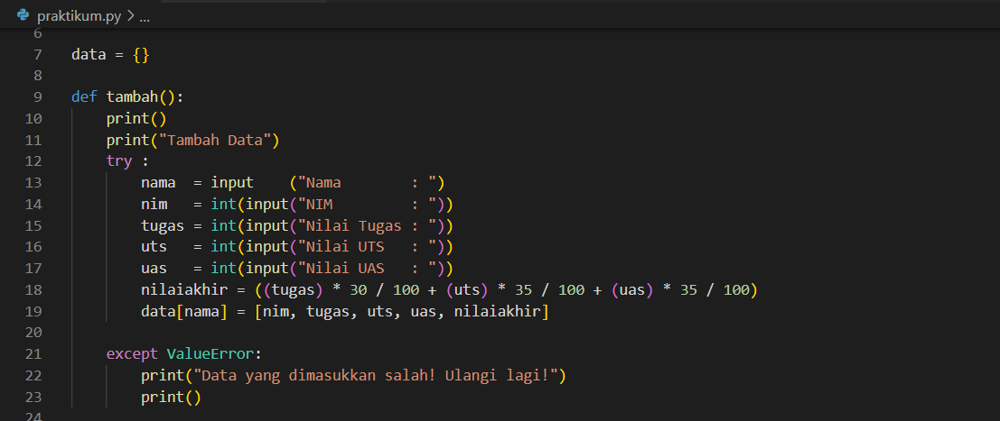
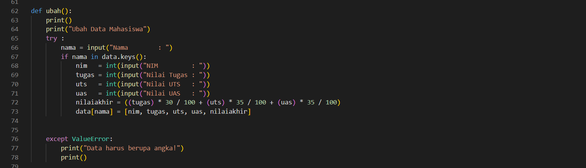
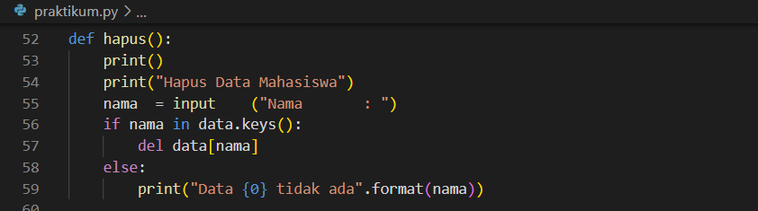
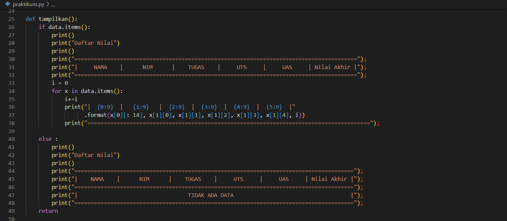

#Praktikum9

# Latihan
Implementasikan penggunaan eksepsi pada lab-lab sebelumnya untuk mengatasi error yang ditimbulkan.

Disini saya menggunakan program pada lab sebelumnya, yaitu program daftar nilai mahasiswa. Yang terdiri dari beberapa fungsi seperti tambah data, ubah data, hapus data dan Tampilkan data.

# Menambah Data

- Fungsi `def tambah()` berfungsi untuk menginput variabel nama, nim, nilai tugas, nilai uts dan nilai uas
-Apabila data yang di inputkan salah, maka kode `except` akan dijalankan

# Output Tambah Data

hasil salah

hasil benar

# Mengubah Data

- Fungsi `def ubah()` berfungsi untuk mengubah data berdasarkan nama.
-Apabila data yang diinputkan salah, maka kode `except` akan dijalankan.

# Output Mengubah Data

hasil salah

hasil benar

# Menghapus Data

- Fungsi `def hapus()` berfungsi untuk menghapus data berdasarkan nama, jika data tidak ada maka akan ditampilkan "Data Tidak Ada".

# Output Menghapus Data

# Menampilkan Data

- Fungsi `def tampilkan()` berfungsi untuk melihat data, jika data tidak ada maka akan ditampilkan tabel dengan tulisan "Tidak Ada Data".

# Output Tampilkan Data

Hasil Masih ada data

Hasil Data sudah terhapus

# Pilih Menu

- Menggunakan perulangan `while` dengan nilai `true` dan menggunakan statement `try` dan `except`.
- Apabila yang diinputkan salah maka akan diminta untuk input ulang.

# Output Tampilkan Pilihan Menu

